# 🏭 Система складського обліку

Веб-додаток для управління складом з повним функціоналом обліку товарів, постачальників, руху товарів та генерації звітів.

## 📋 Зміст

- [Технології](#технології)
- [Функціонал](#функціонал)
- [Архітектура](#архітектура)
- [Design Patterns](#design-patterns)
- [Встановлення та запуск](#встановлення-та-запуск)
- [Структура проекту](#структура-проекту)
- [Діаграми](#діаграми)

## 🛠 Технології

### Backend
- **Node.js** + **TypeScript**
- **Express.js** - веб-фреймворк
- **MySQL** - база даних
- **JWT** - аутентифікація
- **bcrypt** - хешування паролів

### Frontend
- **Next.js 14** (App Router)
- **React** + **TypeScript**
- **Axios** - HTTP клієнт

## ✨ Функціонал

### Ролі користувачів

#### 👤 USER (Користувач)
- Перегляд товарів (без цін)
- Перегляд залишків на складі
- Перегляд статусу складу

#### 👨‍💼 ADMIN (Адміністратор)
- Повний CRUD для товарів
- Управління рухом товарів (надходження, відвантаження, списання)
- Перегляд постачальників
- Перегляд статистики складу

#### 👑 SUPER_ADMIN (Супер Адміністратор)
- Весь функціонал ADMIN
- Управління адміністраторами (створення, деактивація, активація)
- Управління користувачами
- Управління постачальниками (CRUD)
- Генерація звітів:
  - Статус складу на дату
  - Динаміка руху товарів
  - Фінансовий звіт

### Основні можливості

- ✅ Реєстрація товарів (назва, артикул, кількість, ціна, постачальник)
- ✅ Відстеження руху товарів (надходження, відвантаження, списання)
- ✅ Контроль залишків на складі
- ✅ Автоматичні сповіщення про низький запас
- ✅ Генерація звітів
- ✅ Облік постачальників та контрагентів
- ✅ Рольова система доступу

## 🏗 Архітектура

Проект розділений на два основні модулі:

```
Patterns_coursework/
├── backend/          # Node.js + Express API
│   ├── src/
│   │   ├── api/      # REST API endpoints
│   │   ├── services/ # Бізнес-логіка
│   │   ├── patterns/ # Design Patterns
│   │   ├── models/   # Інтерфейси та типи
│   │   └── database.ts
│   └── package.json
│
└── frontend/         # Next.js додаток
    ├── app/          # Pages та layouts
    ├── components/   # React компоненти
    ├── lib/          # Утиліти та API клієнт
    └── package.json
```

## 🎯 Design Patterns

Проект використовує 4 класичні GoF (Gang of Four) патерни проектування:

### 1. 🔔 Observer Pattern (Спостерігач)

**Призначення:** Реалізує механізм підписки для сповіщення множини об'єктів про зміни стану.

**У коді:**
- **`StockAlertSubject`** - Subject (суб'єкт), який зберігає список спостерігачів
- **`NotificationObserver`** - інтерфейс спостерігача
- **Конкретні спостерігачі:**
  - `DatabaseNotificationObserver` - зберігає алерти в БД
  - `LoggerNotificationObserver` - логує алерти в консоль
  - `EmailNotificationObserver` - для майбутньої реалізації email-сповіщень

**Використання:**
```typescript
// backend/src/services/notificationService.ts
this.alertSubject.attach(new DatabaseNotificationObserver());
this.alertSubject.attach(new LoggerNotificationObserver());
this.alertSubject.notifyAll(alert); // Сповіщає всіх спостерігачів
```

**Для чого:** Коли товар досягає мінімального запасу, система автоматично створює алерт і сповіщає всіх зареєстрованих спостерігачів (БД, логер, майбутні email-сповіщення) без жорсткої зв'язаності між компонентами.

**Загальне призначення:** Дозволяє об'єктам сповіщати інші об'єкти про зміни стану, забезпечуючи слабку зв'язаність між видавцем і підписниками.

---

### 2. 🏭 Singleton Pattern (Одиночка)

**Призначення:** Гарантує, що клас має лише один екземпляр і надає глобальну точку доступу до нього.

**У коді:**
- **`NotificationManager`** - клас з приватним конструктором та статичним методом `getInstance()`

**Використання:**
```typescript
// backend/src/patterns/singleton.ts
const manager = NotificationManager.getInstance();
manager.notify(alert);
manager.subscribe(callback);
```

**Для чого:** Забезпечує єдину точку доступу до менеджера сповіщень по всьому додатку. Всі компоненти використовують той самий екземпляр, що дозволяє централізовано керувати підписками та кешем алертів.

**Загальне призначення:** Використовується, коли потрібен рівно один екземпляр класу (логери, пули з'єднань, кеші, конфігурації).

---

### 3. 🎯 Strategy Pattern (Стратегія)

**Призначення:** Визначає сімейство алгоритмів, інкапсулює кожен з них і робить їх взаємозамінними.

**У коді:**
- **`ReportStrategy`** - інтерфейс стратегії
- **Конкретні стратегії:**
  - `WarehouseStatusReportStrategy` - звіт про статус складу
  - `MovementDynamicsReportStrategy` - звіт про динаміку руху товарів
  - `FinancialReportStrategy` - фінансовий звіт
- **`ReportContext`** - контекст, який використовує стратегію

**Використання:**
```typescript
// backend/src/api/reports.ts
const context = new ReportContext();
context.setStrategy(new FinancialReportStrategy());
const report = await context.executeReport(date);
```

**Для чого:** Дозволяє динамічно вибирати алгоритм генерації звіту залежно від типу звіту. Клієнтський код не залежить від конкретної реалізації - він працює з інтерфейсом `ReportStrategy`.

**Загальне призначення:** Використовується, коли є кілька способів виконання однієї задачі, і потрібна можливість вибору алгоритму під час виконання програми.

---

### 4. 🏗 Factory Pattern (Фабрика)

**Призначення:** Надає інтерфейс для створення об'єктів без вказівки їх конкретних класів.

**У коді:**
- **`MovementProcessor`** - абстрактний клас обробника руху
- **Конкретні обробники:**
  - `IncomeMovementProcessor` - обробка надходження
  - `OutcomeMovementProcessor` - обробка відвантаження
  - `WriteOffMovementProcessor` - обробка списання
- **`MovementProcessorFactory`** - фабрика для створення обробників

**Використання:**
```typescript
// backend/src/services/warehouseService.ts
const processor = MovementProcessorFactory.createProcessor(type);
const movement = await processor.process(productId, quantity, documentNumber);
```

**Для чого:** Інкапсулює логіку створення обробників руху товарів. Замість того, щоб створювати об'єкти напряму в коді, використовується фабрика, яка повертає правильний обробник залежно від типу операції (INCOME, OUTCOME, WRITE_OFF).

**Загальне призначення:** Спрощує створення об'єктів, приховуючи складну логіку ініціалізації та дозволяючи додавати нові типи без зміни існуючого коду.

---

## 🚀 Встановлення та запуск

### Вимоги
- Node.js 18+
- MySQL 8+
- npm або yarn

### Крок 1: Клонування репозиторію
```bash
git clone <repository-url>
cd Patterns_coursework
```

### Крок 2: Налаштування Backend

```bash
cd backend
npm install
```

Створіть файл `.env` в папці `backend/`:
```env
DB_HOST=localhost
DB_USER=root
DB_PASSWORD=your_password
DB_NAME=warehouse_db
PORT=3001
JWT_SECRET=your_secret_key
SUPER_ADMIN_EMAIL=admin@warehouse.local
SUPER_ADMIN_PASSWORD=Admin123!
DEFAULT_USER_EMAIL=user1@warehouse.local
DEFAULT_USER_PASSWORD=User123!
```

Запустіть backend:
```bash
npm run dev
```

### Крок 3: Налаштування Frontend

```bash
cd frontend
npm install
```

Створіть файл `.env.local` в папці `frontend/`:
```env
NEXT_PUBLIC_API_URL=http://localhost:3001/api
```

Запустіть frontend:
```bash
npm run dev
```

### Крок 4: Доступ до додатку

- Frontend: http://localhost:3000
- Backend API: http://localhost:3001

### Дефолтні облікові записи

**Super Admin:**
- Email: `admin@warehouse.local`
- Password: `Admin123!`

**User:**
- Email: `user1@warehouse.local`
- Password: `User123!`

## 📁 Структура проекту

```
Patterns_coursework/
├── backend/
│   ├── src/
│   │   ├── api/
│   │   │   ├── auth.ts          # Аутентифікація та авторизація
│   │   │   ├── products.ts       # CRUD товарів
│   │   │   ├── suppliers.ts     # CRUD постачальників
│   │   │   ├── warehouse.ts      # Операції зі складом
│   │   │   └── reports.ts        # Генерація звітів
│   │   ├── services/
│   │   │   ├── productService.ts
│   │   │   ├── warehouseService.ts
│   │   │   └── notificationService.ts
│   │   ├── patterns/
│   │   │   ├── observer.ts       # Observer Pattern
│   │   │   ├── singleton.ts      # Singleton Pattern
│   │   │   ├── strategy.ts       # Strategy Pattern
│   │   │   └── factory.ts        # Factory Pattern
│   │   ├── models/
│   │   │   └── entities.ts       # TypeScript інтерфейси
│   │   ├── database.ts           # Ініціалізація БД
│   │   └── server.ts              # Express сервер
│   └── package.json
│
└── frontend/
    ├── app/
    │   ├── page.tsx               # Головна сторінка
    │   ├── layout.tsx             # Root layout
    │   ├── products/              # Сторінки товарів (для USER)
    │   ├── user/
    │   │   └── login/            # Логін користувача
    │   └── admin/
    │       ├── layout.tsx         # Admin layout
    │       ├── login/             # Логін адміна
    │       ├── page.tsx           # Admin dashboard
    │       ├── products/          # Управління товарами
    │       ├── suppliers/         # Управління постачальниками
    │       ├── warehouse/          # Управління складом
    │       ├── admins/            # Управління адмінами
    │       ├── users/             # Управління користувачами
    │       └── reports/           # Звіти
    ├── components/
    │   ├── Navigation.tsx         # Навігація для публічних сторінок
    │   ├── UserNavigation.tsx     # Навігація для користувачів
    │   ├── Modal.tsx              # Модальні вікна
    │   └── ConfirmationModal.tsx   # Модальні вікна підтвердження
    ├── lib/
    │   └── api.ts                 # API клієнт
    └── package.json
```

## 📊 Діаграми

### Use Cases Діаграма

```mermaid
graph TB
    User[👤 Користувач]
    Admin[👨‍💼 Адміністратор]
    SuperAdmin[👑 Супер Адміністратор]
    
    User --> UC1[Перегляд товарів]
    User --> UC2[Перегляд залишків]
    User --> UC3[Перегляд статусу складу]
    
    Admin --> UC1
    Admin --> UC2
    Admin --> UC3
    Admin --> UC4[Управління товарами]
    Admin --> UC5[Управління рухом товарів]
    Admin --> UC6[Перегляд постачальників]
    Admin --> UC7[Перегляд статистики]
    
    SuperAdmin --> UC4
    SuperAdmin --> UC5
    SuperAdmin --> UC6
    SuperAdmin --> UC7
    SuperAdmin --> UC8[Управління адміністраторами]
    SuperAdmin --> UC9[Управління користувачами]
    SuperAdmin --> UC10[Управління постачальниками]
    SuperAdmin --> UC11[Генерація звітів]
    
    UC4 --> UC4a[Створення товару]
    UC4 --> UC4b[Редагування товару]
    UC4 --> UC4c[Видалення товару]
    UC4 --> UC4d[Перегляд товарів]
    
    UC5 --> UC5a[Надходження товару]
    UC5 --> UC5b[Відвантаження товару]
    UC5 --> UC5c[Списання товару]
    
    UC11 --> UC11a[Звіт про статус складу]
    UC11 --> UC11b[Звіт про динаміку руху]
    UC11 --> UC11c[Фінансовий звіт]
    
    style User fill:#e1f5ff
    style Admin fill:#fff4e1
    style SuperAdmin fill:#ffe1e1
```



### UML Діаграма класів

```mermaid
classDiagram
    %% Entities
    class Product {
        +string id
        +string name
        +string article
        +number quantity
        +number price
        +string supplierId
        +number minStock
        +Date createdAt
        +Date updatedAt
    }
    
    class Supplier {
        +string id
        +string name
        +string phone
        +string email
        +string address
        +Date createdAt
        +Date updatedAt
    }
    
    class WarehouseMovement {
        +string id
        +string productId
        +string type
        +number quantity
        +Date date
        +string documentNumber
        +string notes
        +Date createdAt
    }
    
    class StockAlert {
        +string id
        +string productId
        +string message
        +boolean isRead
        +Date createdAt
    }
    
    class AdminUser {
        +string id
        +string email
        +string password
        +string role
        +boolean isActive
        +Date createdAt
    }
    
    class User {
        +string id
        +string email
        +string password
        +string name
        +string role
        +boolean isActive
        +Date createdAt
        +Date updatedAt
    }
    
    %% Observer Pattern
    class StockAlertSubject {
        -NotificationObserver[] observers
        +attach(observer)
        +detach(observer)
        +notifyAll(alert)
    }
    
    class NotificationObserver {
        <<interface>>
        +update(alert)
    }
    
    class DatabaseNotificationObserver {
        +update(alert)
    }
    
    class LoggerNotificationObserver {
        +update(alert)
    }
    
    class EmailNotificationObserver {
        +update(alert)
    }
    
    %% Singleton Pattern
    class NotificationManager {
        -static NotificationManager instance
        -Array subscribers
        -Map alertCache
        -constructor()
        +static getInstance()
        +subscribe(callback)
        +unsubscribe(callback)
        +notify(alert)
        +getAllAlerts()
    }
    
    %% Strategy Pattern
    class ReportStrategy {
        <<interface>>
        +generate(date)
    }
    
    class WarehouseStatusReportStrategy {
        +generate(date)
    }
    
    class MovementDynamicsReportStrategy {
        +generate(date)
    }
    
    class FinancialReportStrategy {
        +generate(date)
    }
    
    class ReportContext {
        -ReportStrategy strategy
        +setStrategy(strategy)
        +executeReport(date)
    }
    
    %% Factory Pattern
    class MovementProcessor {
        <<abstract>>
        +process(productId, quantity, documentNumber)
        #createMovement(...)
    }
    
    class IncomeMovementProcessor {
        +process(productId, quantity, documentNumber)
    }
    
    class OutcomeMovementProcessor {
        +process(productId, quantity, documentNumber)
    }
    
    class WriteOffMovementProcessor {
        +process(productId, quantity, documentNumber)
    }
    
    class MovementProcessorFactory {
        +static createProcessor(type)
    }
    
    %% Services
    class ProductService {
        +getAllProducts()
        +getProduct(id)
        +createProduct(data)
        +updateProduct(id, data)
        +deleteProduct(id)
    }
    
    class WarehouseService {
        +getWarehouseStatus()
        +createMovement(type, productId, quantity, documentNumber)
    }
    
    class NotificationService {
        -StockAlertSubject alertSubject
        +sendStockAlert(productId, productName, currentStock, minStock)
        +checkAndNotifyLowStock(productId)
        +getNotificationManager()
    }
    
    %% Relationships
    Product "1" --> "*" WarehouseMovement : has
    Product "1" --> "*" StockAlert : generates
    Product "*" --> "1" Supplier : belongs to
    
    StockAlertSubject "1" --> "*" NotificationObserver : notifies
    DatabaseNotificationObserver ..|> NotificationObserver : implements
    LoggerNotificationObserver ..|> NotificationObserver : implements
    EmailNotificationObserver ..|> NotificationObserver : implements
    
    NotificationService --> StockAlertSubject : uses
    NotificationService --> NotificationManager : uses
    
    ReportContext --> ReportStrategy : uses
    WarehouseStatusReportStrategy ..|> ReportStrategy : implements
    MovementDynamicsReportStrategy ..|> ReportStrategy : implements
    FinancialReportStrategy ..|> ReportStrategy : implements
    
    MovementProcessorFactory --> MovementProcessor : creates
    IncomeMovementProcessor --|> MovementProcessor : extends
    OutcomeMovementProcessor --|> MovementProcessor : extends
    WriteOffMovementProcessor --|> MovementProcessor : extends
    
    WarehouseService --> MovementProcessorFactory : uses
    ProductService --> NotificationService : uses
```



## 📝 Примітки

- Всі паролі хешуються за допомогою bcrypt
- JWT токени використовуються для аутентифікації
- База даних автоматично ініціалізується при першому запуску
- Система автоматично створює дефолтні облікові записи при ініціалізації

## 📄 Ліцензія

Цей проект створено в навчальних цілях.
